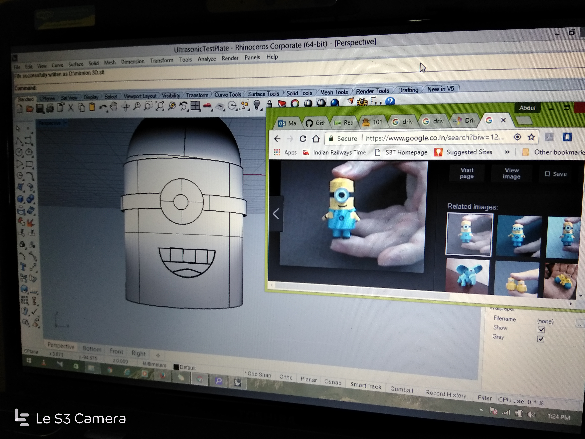
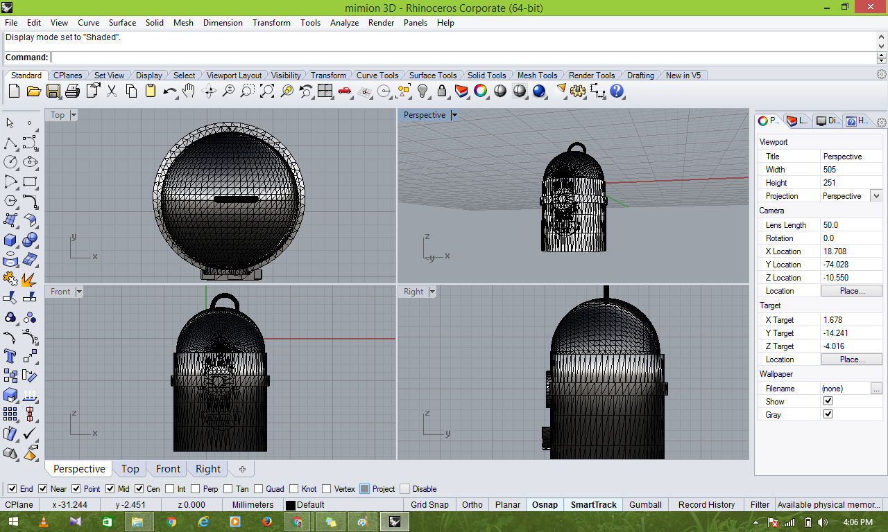
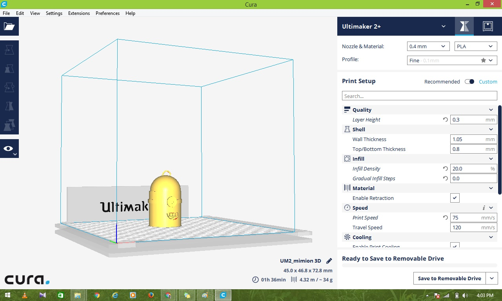
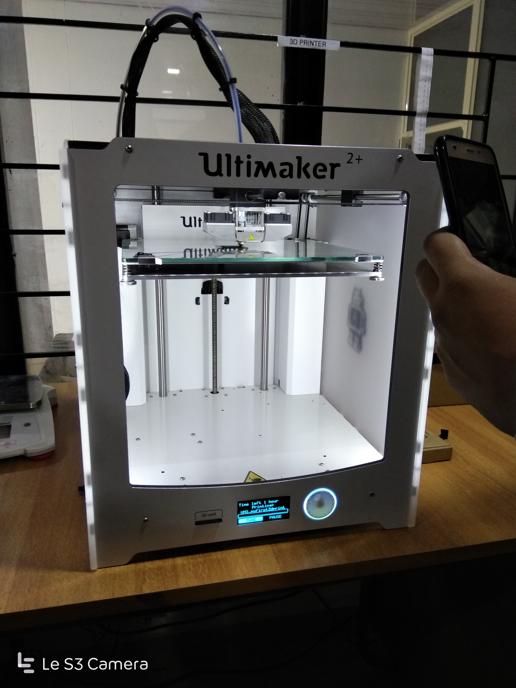
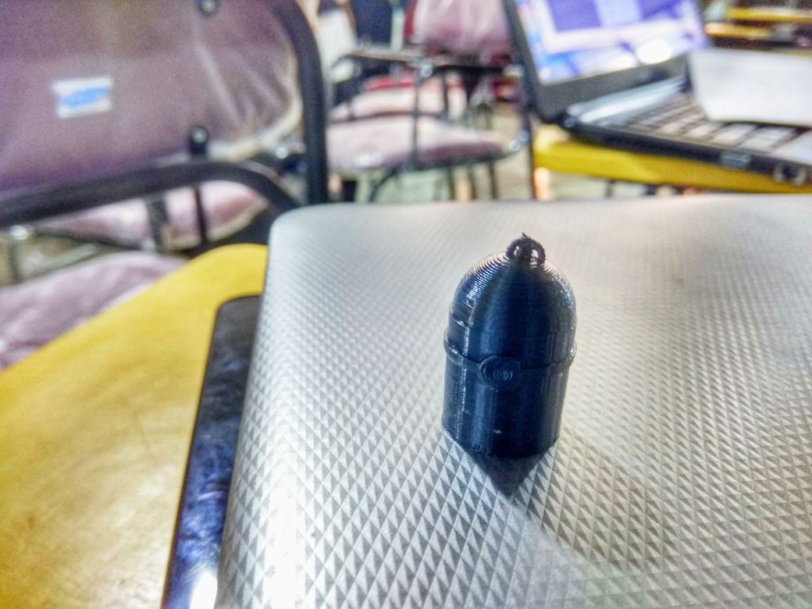

# 3D Printer

## 3D DESIGN OF MINION

### STEP 1: Designing the model

#### The 3D design of the model was developed using Rhinoceros 3D.The design file is in .stl format.

[minion.stl](https://tpmabdulkareem.github.io/mimion 3D.stl) 

### STEP 2: Transfer to Cura

#### The .3dm file is converted to .stl fil to be edited in Cura software, for adding support structure, analysing dimensions and build time.The design file is in .gcode format.

[minion.gcode](https://tpmabdulkareem.github.io/UM2_mimion 3D.gcode) 

### STEP 3: Printing using Ultimaker 2+

#### The prototype is 3D printed from the design file using Ultimaker 2+ printer.

#### Completed Model

-----

