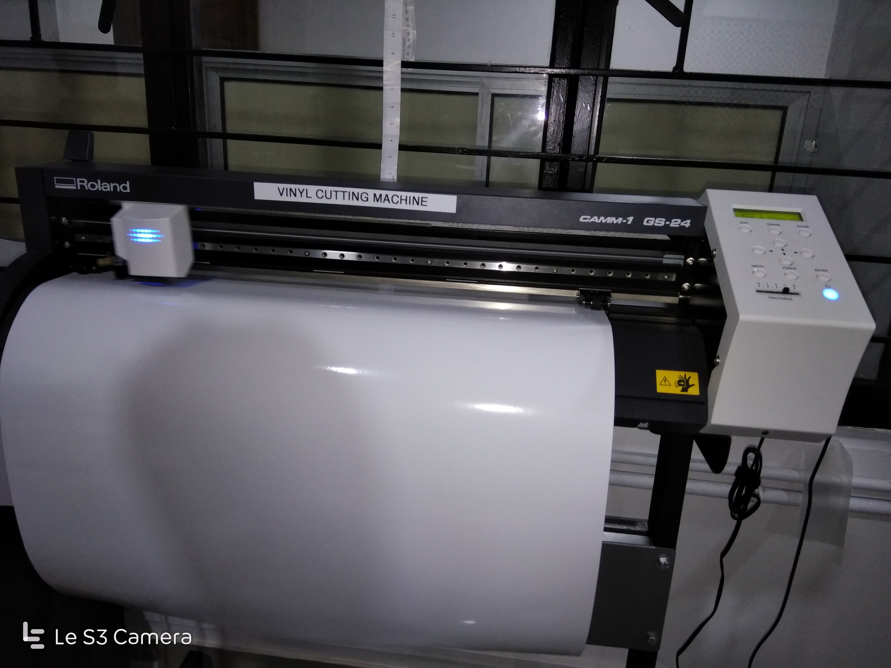

#                                             Vinyl Cutting

### _A vinyl cutter is a type of computer-controlled machine. Small vinyl cutters look like computer printers. The computer controls the movement of a sharp blade. This blade is used to cut out shapes and letters from sheets of thin self-adhesive plastic (vinyl)._

###   _Symbol / label can be produced using a Vinyl Cutter such as a ‘Sticker Machine’ or a ‘Craftrobo’. These machines are controlled by a computer and operate similar to a printer. Essentially they cut out shapes in adhesive vinyl. The vinyl can then be stuck onto almost any surface._
 
 
## What is Easy Cut Studio?
 
 _Easy Cut Studio is a robust tool for designers who want easy ways to cut TrueType or OpenType fonts.
 In addition, you can import vector graphics like PLT, DXF, WPC, AI, EIPS, PDF, and SVG to cut and edit them._
 
 _Amateurs who wish to cut designs for not so professional tasks can utilize the app’s image tracing function to convert images to vector graphics like SVG and cut them. You can even create new shapes to cut using the robust drawing tools offered with the software._
 
 _There is a vast library with a number of preset fonts and shapes that you will find useful for professional projects.On top of that, you can blend in images and letters as well as apply styles like Blackout and Shodows to add more style to your design_
 
 
 
## Steps of vinyl cutting for text/logo/sticker

###  1. Open the wanted pictures using CutStudio Software.

     
###  2. Take out its outline and get printed out.

-----------------
