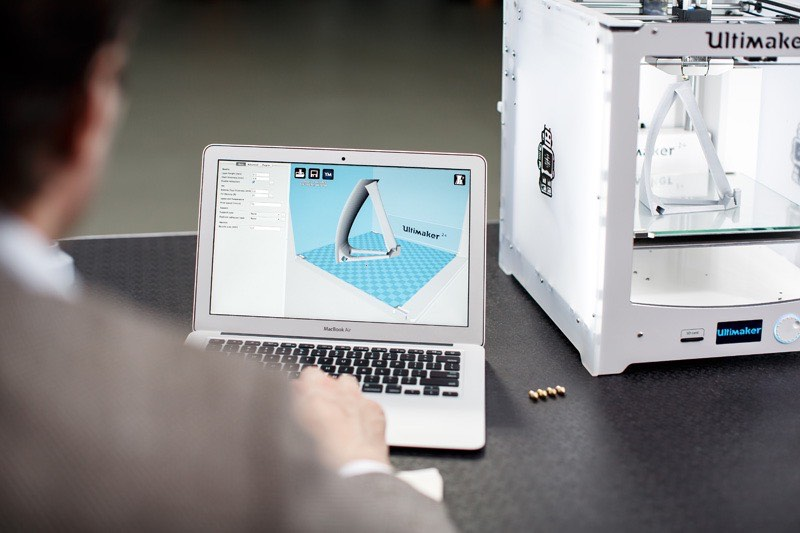

#                                                     3D Printing
   
    
#### _3D D Printing is an additive manufacturing process that creates a physical object from a digital design.There are different 3D printing technologies and materials you can print with,but all are based on the same principle: a digital model is turned into a solid three-dimensionalphysical object by adding material layer by layer._

|<video src="hero_loop_alpha.webm"  width="320" height="200" controls preload> | <video src="teleport-animation.webm"  width="320" height="200" controls preload>|
    
    
 ##  How does 3D printing work?

   _Every 3D print starts as a digital 3D design file – like a blueprint – for a physical object. Trying to print without a design file is like trying to print a document on a sheet of paper without a text file. This design file is sliced into thin layers which is then sent to the 3D printer._
                     _From here on the printing process varies by technology, starting from desktop printers that melt a plastic material and lay it down onto a print platform to large industrial machines that use a laser to selectively melt metal powder at high temperatures. The printing can take hours to complete depending on the size, and the printed objects are often post-processed to reach the desired finish._

                
.
  
