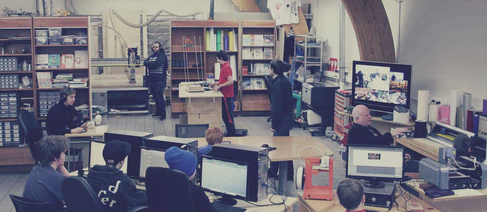

##                                        A Documentation oF Mini-FAB Lab MESCE
 

## ABOUT ME
# T P M ABDULKAREEM.*
  S7, ECE-B.*
  MESCE KUTTIPPURAM.*
  [More...](https://tpmabdulkareem.github.io/About).*

## FAB LAB

    Fab labs provide widespread access to modern means for invention. They began as an outreach project from MIT's Center for Bits and    Atoms (CBA), and became into a collaborative and global network. You can find more information about Fab Labs on the Fab Foundation   Website. The annotated photo below illustrates the facilities of a typical Fab Lab.
    
    
## SYLLABUS
  Day 1 : [Indroduction To Fablab](https://tpmabdulkareem.github.io/Day1)

  Day 2 : Github Pages and Documentation
                               
  Day 3: Electronics Production and CNC
                                
  DAY 4 : Vinyl Cutting
                                	
  DAY 5 : Screen Printing
                                	
  DAY 6 : 3D Printing
                                
  Day 7 : Laser Cutting,Moulding and Casting
                                
  Project

