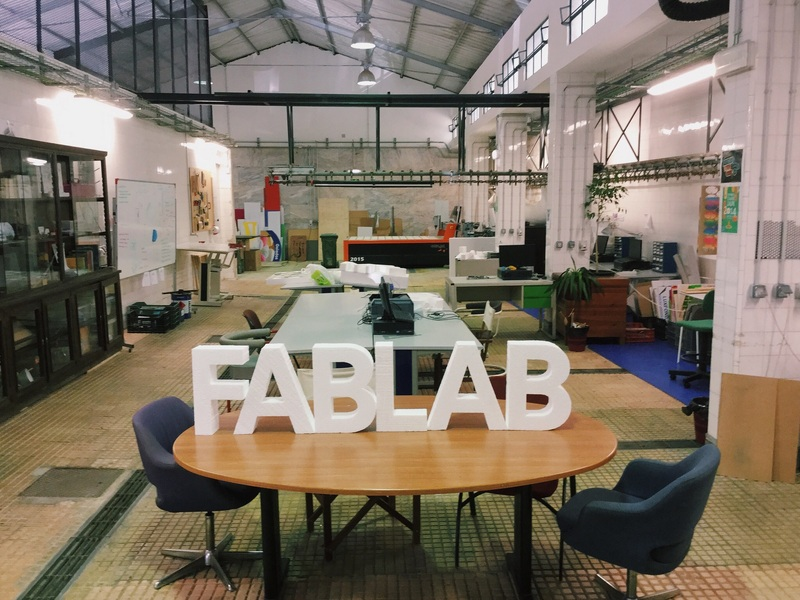

##                                          Welcome to Kareem's Fablab 
  

                                            

### "_Make Almost Anything!, a brilliant creative space for budding product designers and entrepreneurs to test out their ideas and bring them to life._"

### What is fablab?

   _Fab labs provide widespread access to modern means for invention. They began as an outreach project from MIT's Center for Bits and    Atoms (CBA), and became into a collaborative and global network. You can find more information about Fab Labs on the Fab Foundation   Website. The annotated photo below illustrates the facilities of a typical Fab Lab._
   
   _A fab lab (fabrication laboratory) is a small-scale workshop offering (personal) digital fabrication. A fab lab is typically equipped with an array of flexible computer-controlled tools that cover several different length scales and various materials, with the aim to make "almost anything". This includes technology-enabled products generally perceived as limited to mass production._
   
  _While fab labs have yet to compete with mass production and its associated economies of scale in fabricating widely distributed products, they have already shown the potential to empower individuals to create smart devices for themselves. These devices can be tailored to local or personal needs in ways that are not practical or economical using mass production._
   
   _The fab lab movement is closely aligned with the DIY, the open source hardware and the free and open source movement, and shares philosophy as well as technology with them._
   
   ----
   
  
#  [ABOUT ME](https://tpmabdulkareem.github.io/About)  (Click here) 
   
-----

# _Course Progress_

##   _SYLLABUS & CONTENTS_

  Day 1 : [Introduction To Fablab](https://tpmabdulkareem.github.io/Day1)

  Day 2 : [Github Pages and Documentation](https://tpmabdulkareem.github.io/Day2)
                               
  Day 3 : [Laser Cutting,Moulding and Casting](https://tpmabdulkareem.github.io/Day3)
                                
  Day 4 : [Vinyl Cutting](https://tpmabdulkareem.github.io/Day4)
                                	
  Day 5 : [Screen Printing](https://tpmabdulkareem.github.io/Day5)
                                	
  Day 6 : [3D Printing](https://tpmabdulkareem.github.io/Day6)
                                
  Day 7 : [Electronics Production and CNC](https://tpmabdulkareem.github.io/Day7)
  
  ----
                                
##   [Projects](https://tpmabdulkareem.github.io/project)
 
 -----
 
 
## [Gallery](https://tpmabdulkareem.github.io/gallery)

#####   +919746186861
 
 
 -----
 
 

