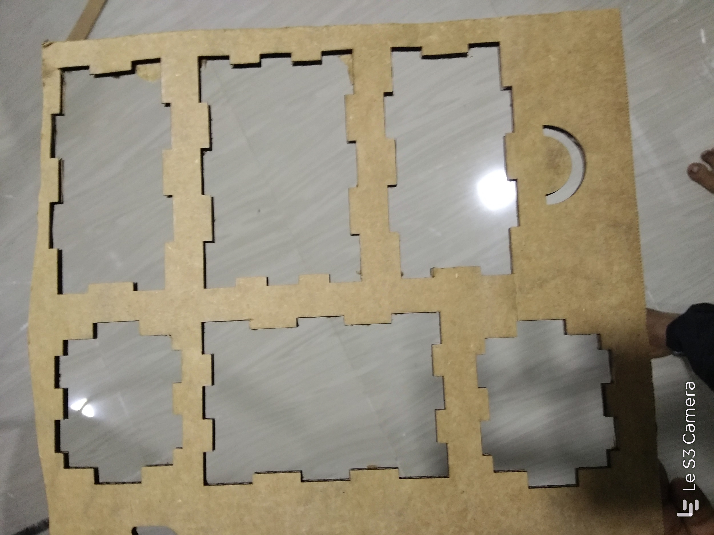

# CARDBOARD BOX

## STEP 1: Designing the model

### The 2D design of the model was developed using Rhinoceros 3D.

## STEP 2: Cutting using Laser cutter

### The .3dm file is printed usiing the laser cutter on a 6mm thick cardboard under 100% power. After an approximate cut time of 2 minutes, the cut piece of the protoype was obtained.

## STEP 3: Assembly

### The prototype is assembled manually.

## COMPLETED MODEL

-----
