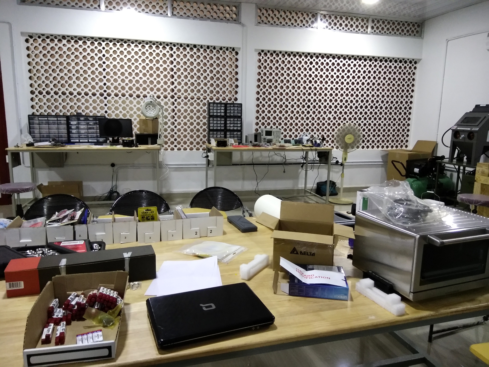
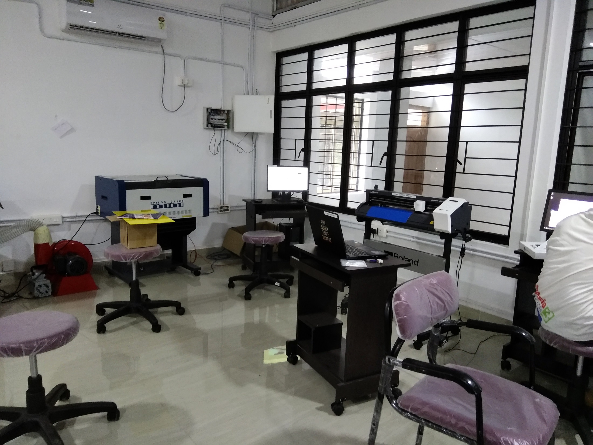
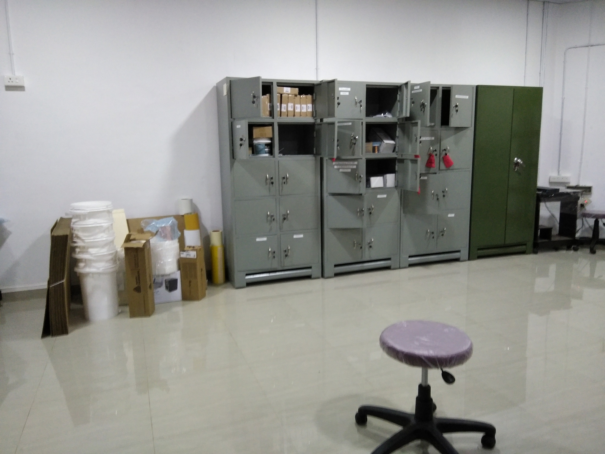
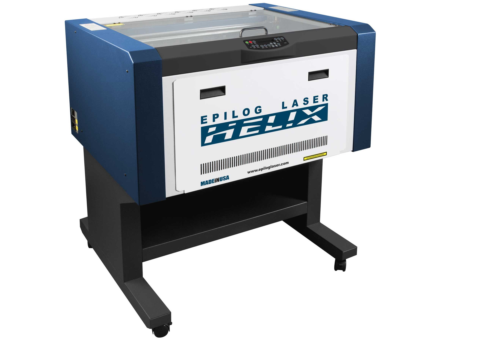
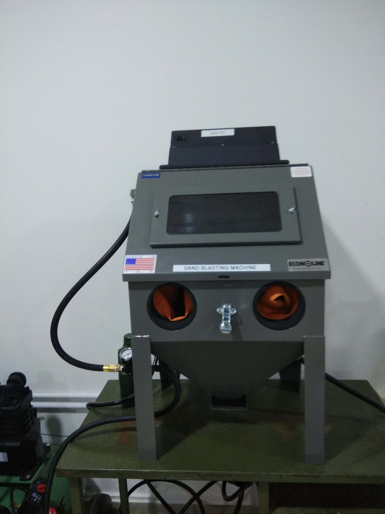

# MINI-FAB LAB MESCE

## "When you create, you have glimpsed the Divine."

## [MES FABLAB](https://www.fablabs.io/labs/mesce)

## INSIDE FABLAB

## FABLAB CREWS

### FACULTIES

### COURSE CONDUCTED BY MR. JASEEL MUHAMMED
#### Fab Graduate from Fab Academy, Trivandrum

## FABLAB STAFF IN-CHARGE

### Prof. Shine K,
####   DEPT. OF MECHANICAL
####   MESCE KUTTIPPURAM
   

----

## SHOPBOT DESKTOP

 

## 3D PRINTER ULTIMAKER 2+

## EPILOG LASER CUTTER

## SAND BLASTING MACHINE

## ROLAND VINYL CUTTER 

## ELECTRONIC EQUIPMENTS

-------------

