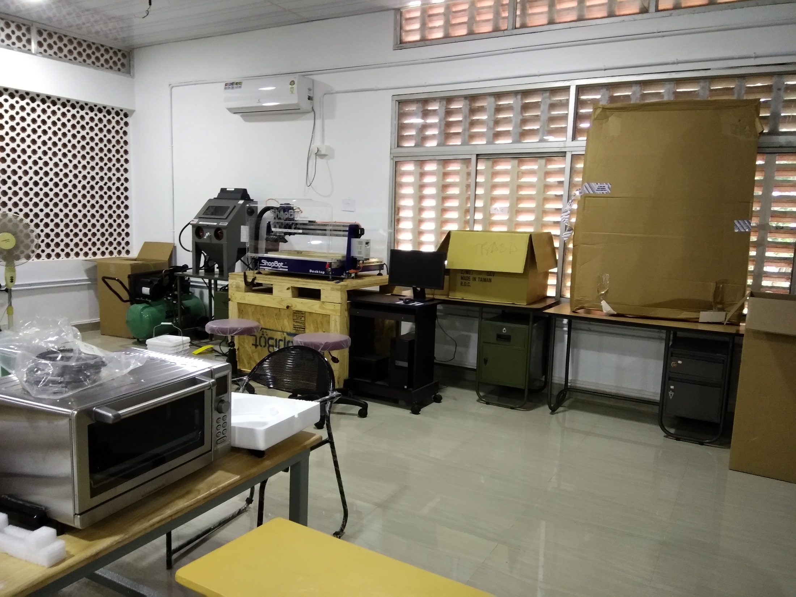
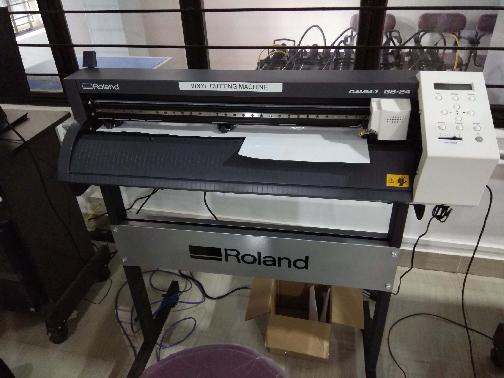

# MINI-FAB LAB MESCE

## "When you create, you have glimpsed the Divine."

## INSIDE FABLAB

## FABLAB TEAM

### FABLAB CREWS

## FACULTIES

### COURSE CONDUCTED BY MR. JASEEL MUHAMMED [Fab Graduate from Fab Academy, Trivandrum]

## FABLAB STAFF IN-CHARGE

### Prof. Shine K,
   DEPT. OF MECHANICAL
   MESCE KUTTIPPURAM
   

## SHOPBOT DESKTOP

 

## 3D PRINTER ULTIMAKER 2+

## EPILOG LASER CUTTER

## SAND BLASTING MACHINE

## ROLAND VINYL CUTTER 

## ELECTRONIC EQUIPMENTS

