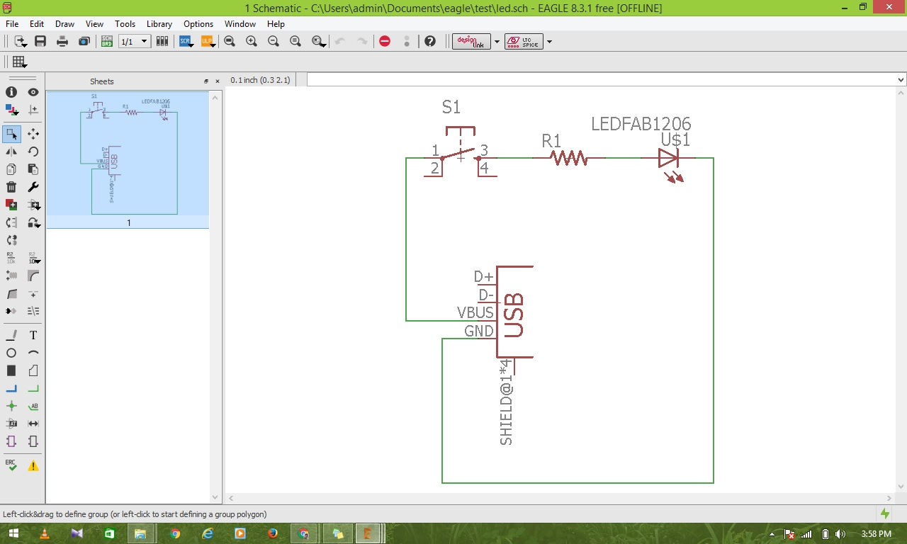
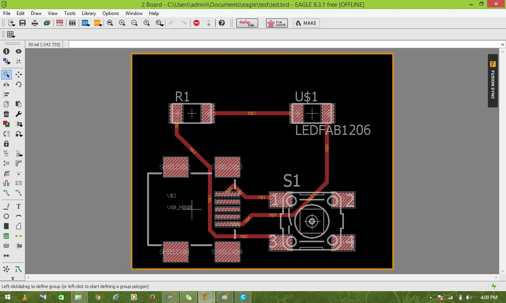
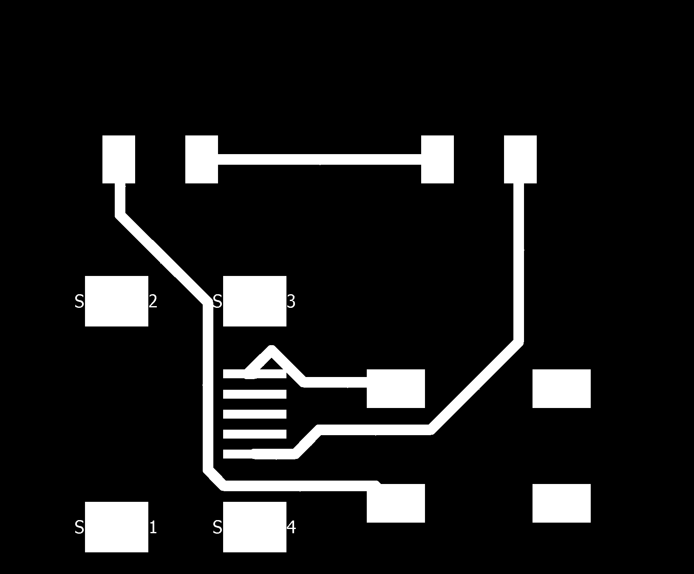
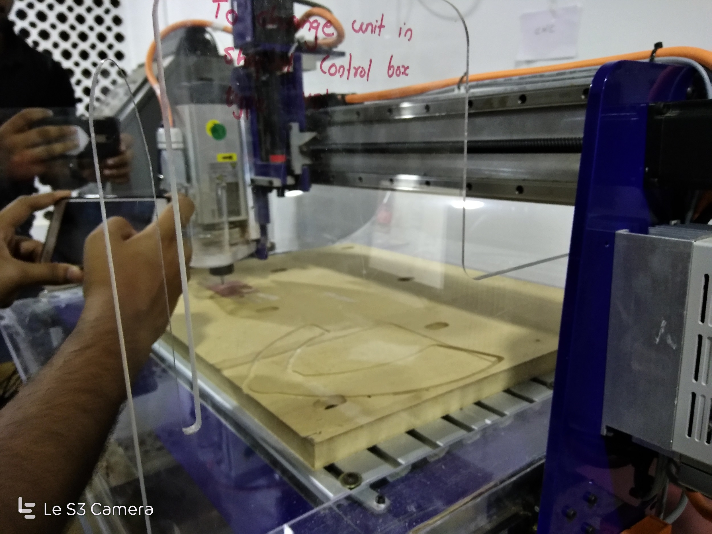
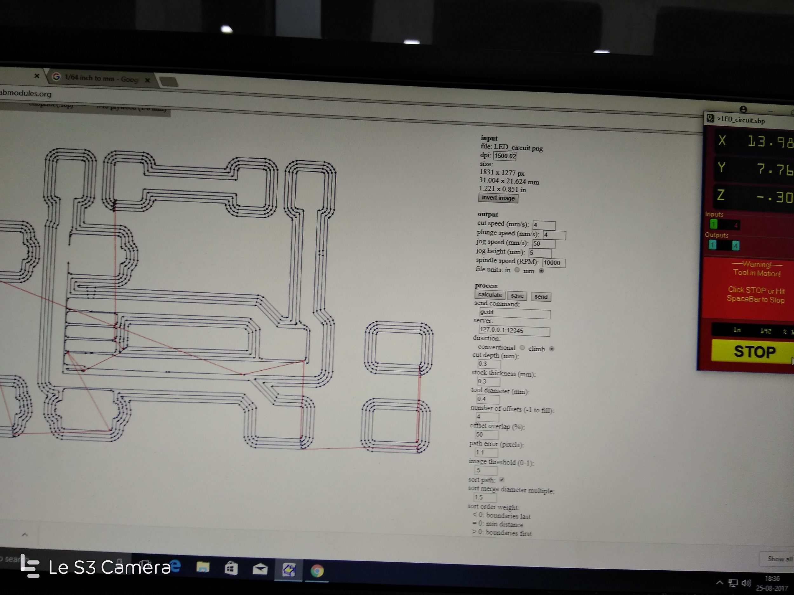
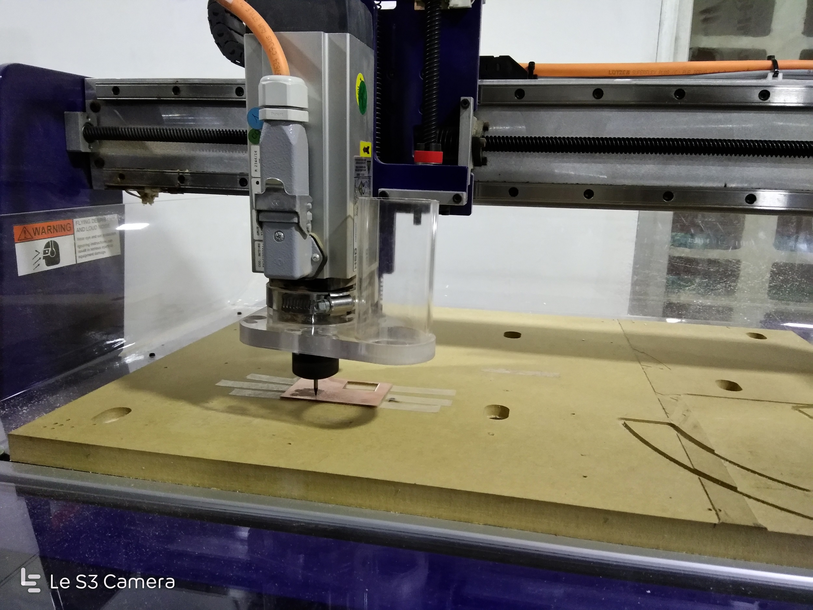
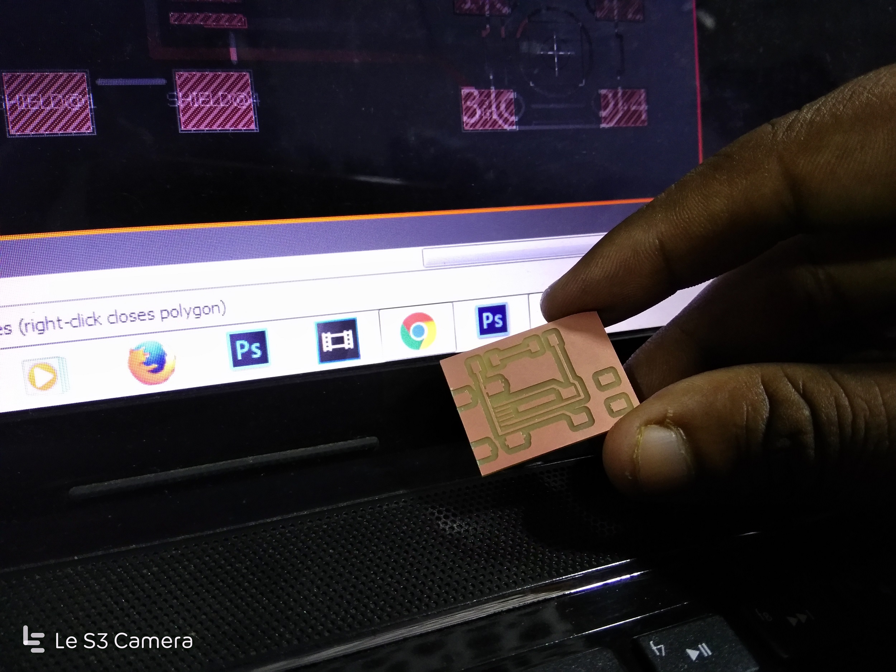
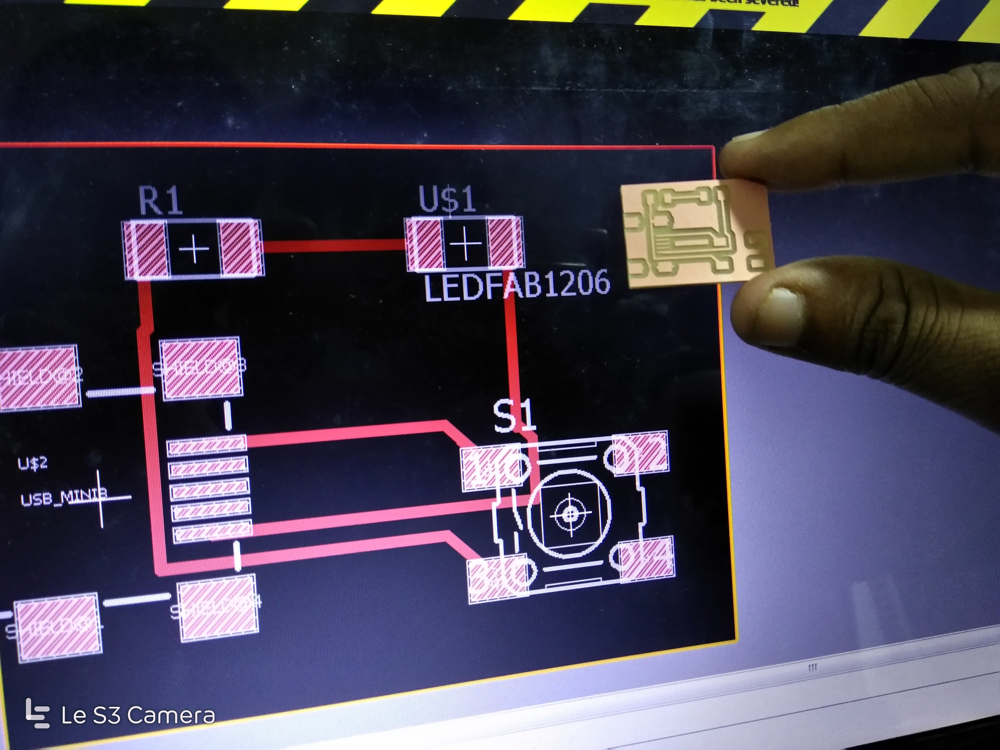
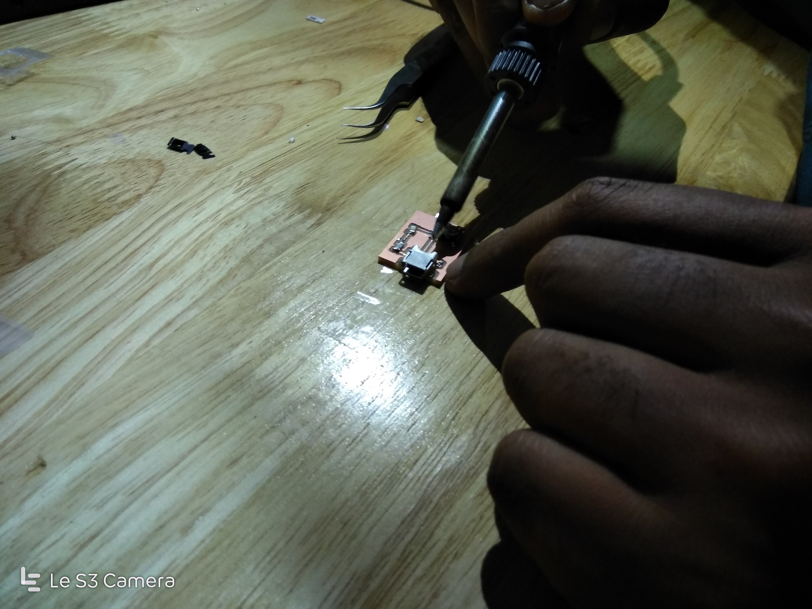

# PCB DESIGN

## LED WITH SWITCH CIRCUIT

### STEP 1: Designing the model

#### The 2D design of the model was developed using Autodesk Eagle.

### STEP 2: Autorouting using Eagle

#### THe designed circuit is routed using the autoroute feature in Autodesk Eagle

### STEP 3: Processing using fabmodules.org

#### The .png format of Trace is uploaded to fabmodules.org and procesed with desired values

### STEP 4: Milling using ShopBot CNC

#### The processed gcode of the PCB design is milled using Shopbot CNC machine.

#### The Processed PCB Board is taken out and cleaned from ShopBot.

### STEP 5: soldering

#### Bend the leads of the part so that it stays in its place. Put the tip of the iron on the pad so that it heats 
both the lead of the part and the pad of the circuit board. Heat them for a second or so before you apply solder.
Remove the iron and the solder wire and inspect your solder joint to see if it looks okay.

----

