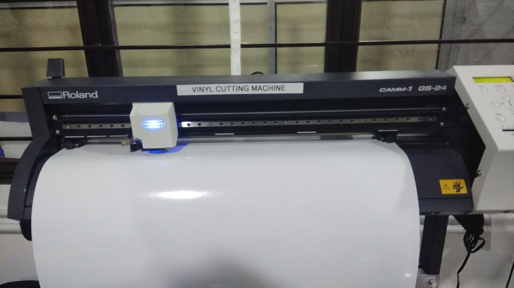
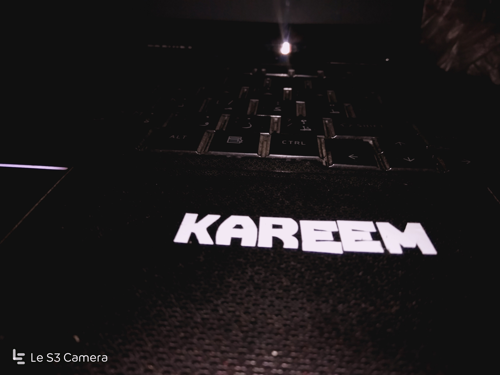
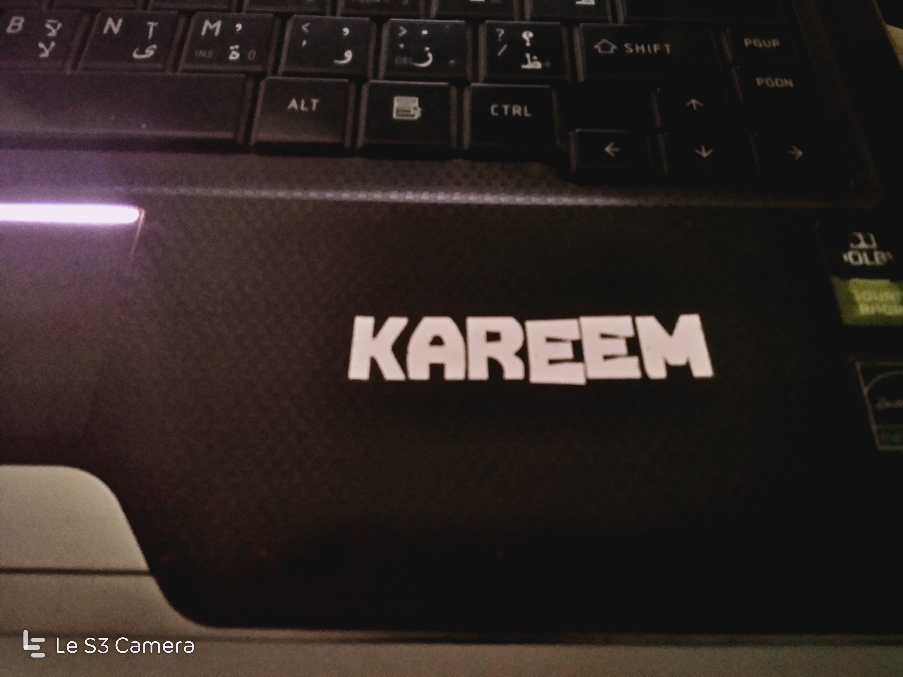
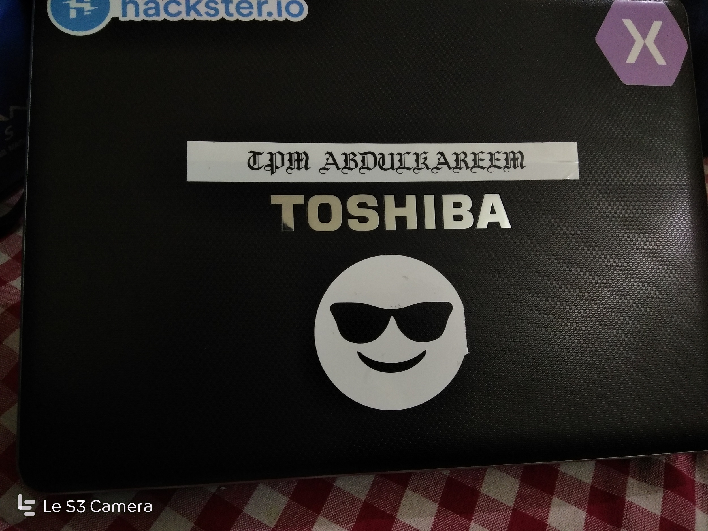

# A Text Sticker

## STEP 1: Designing the model

### The 2D design of the model was developed using CutStudio.

## STEP 2: Cutting using Vinyl cutter

### The cutstudio file is printed usiing the vinyl cutter on a 15mm X 15mm vinyl sheet piece. After an approximate cut time of 30 seconds, the cut piece of the protoype was obtained.

## STEP 3: Pasting

### The prototype is pated on laptop surface manually.

## Completed Model.

### other works

